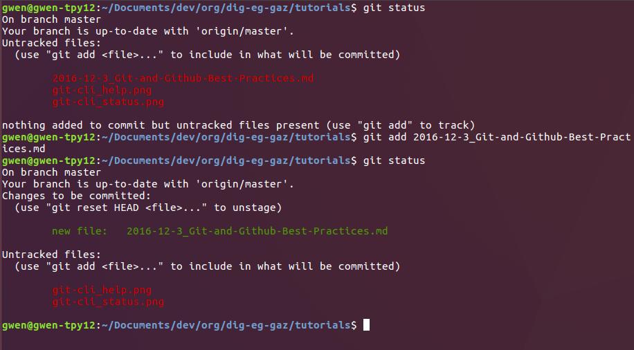
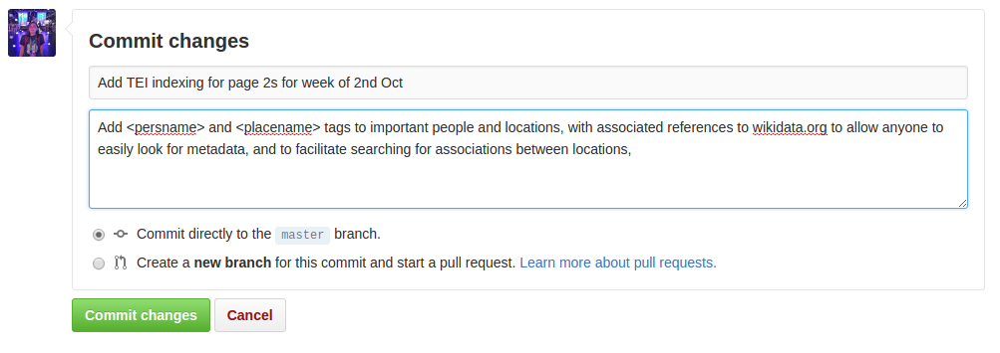

# Git & Github

Git and Github allow for ad-hoc, continuous, and seamless collaboration between many parties on open-source programming projects.  And while Git and Github clearly focus on software development applications, they work for any text-based initiative.

But how do they work their unique magic?

Git and Github perform version control; they allow for fast and painless branching, updating, and revision of text files, with a full history of all changes ever made to the files in the project.  This means you can find the source of issues in code, and revert problematic changes when they appear.

## What is Git?

**Side note:** I use [Ubuntu](https://www.ubuntu.com/desktop) on my computer, so things will work and look totally different from a Windows Computer ([for now](https://msdn.microsoft.com/en-us/commandline/wsl/about)), and just a little different compared to a Mac.

**If the terminal/command-line scares you**, then skip to the "What is GitHub" section for now.

### Installation instructions:

- [Windows](https://git-scm.com/download/win)
- [Mac OSX](https://git-scm.com/download/mac)
- [Linux & Unix](https://git-scm.com/download/linux)
- [Solaris](https://git-scm.com/download/linux)
- [GUI clients](https://git-scm.com/downloads/guis)

### Quick Overview

Git is a command-line tool that software developers use to manage their software. It works using the `git` command in the terminal.  Typing either `man git` or `git --help` will provide an overview of how to use git.


You can get more information on a specific command with `git <command> --help`.  For example, `git status --help`, `git add --help`, `git commit --help`, and `git remote --help`.

Command-line git enforces a general workflow:

```
~$ git status
~$ git add <filename or filenames>
~$ git status
~$ git commit
```



`git status` shows the user what's going on in their files.  The red files are files that have never been tracked by git before.  You have to add them with `git add <filename or filenames>` for git to know you want to track them.  Once you have added a file, it goes into the staging area: this is where you add the specific files or lines you actually want to commit to the history, with a commit message that describes the changes you have made.  Any files that have been tracked in the history will show up in `git status` when you have changed them, making it extremely trivial to know when you have changed something.

For a full tutorial on Git, check out [the official Git Book](https://git-scm.com/), or watch the Git essential training series on [Lynda.com](https://www.lynda.com/Git-tutorials/Git-Essential-Training/100222-2.html).

## What is Github?


Using Git through the command-line has some limitations; git does not provide a place for teams to communicate, to easily see each-other's work without downloading it to their machine, search for new projects, get announcements, track bugs, and many other important software development functions.  Several websites began to appear providing a web interface for Git.  Github is the most popular and successful one.  Other examples include:

- [Git Lab](https://about.gitlab.com/)
- [Bit Bucket](https://bitbucket.org/)
- [Git Web](https://git-scm.com/docs/gitweb)
- [SCM Manager](https://www.scm-manager.org/)
- [Launchpad](https://launchpad.net/)

**You can find [on-demand Github Training](https://services.github.com/on-demand/) from Github, for free online.**  They offer training for the GitHub web interface, and for the command-line tool.

# Best Practices

using Git & Github _do not_ automatically make a project successful.  **Git keeps track of the what,** but we have to provide it the why.  Git is a truly amazing tool, with some really advanced technology under-the-hood.  However, it can not tell the intention behind our actions; it can't tell the meaning of our changes.  Many of the features of Git and Github exist to add this meaning to the history of a project, so it becomes easy to keep track of not only the work that's been done, but the work that hasn't been done, and the important decisions made along the way.

## Commits

No best practice has more impact than **writing good commit messages.**.  Commit messages must describe the patch.  A commit message, by convention, follows this format:

```
Short, 50 character or less description

A longer, multi-line description that goes into more detail about the
patch, which by convention is about 72 characters long per line.
This should provide extra contextual information.

You can add bullet lists like
- an item
- another item

Reference conversations, issues, or pull requests, etc.
Show that certain project members have "signed-off" on the patch.
(Useful for merge or pull requests in projects that have a code
 review process.)
```

When crafting a commit message, keep the following in mind:

- What am I changing?
- Why have I changed it?
- What does everyone else need to know about my changes?

The short summary of a commit message should be written in the present imperative tense.  For example:

- `Fix mal-formed <div> elements`
- `Add page 2 and 3 of Oct 5th issue`
- `Fix well-formedness error`
- `Replace & with escaped &amp;`
- `Revise blog-post for grammar & style`
- `Fix improper indentation`
- `Upload images for "blog-post-name"`

While this tense appears rude at first, it produces more descriptive, shorter, easier-to-read messages because the important verb comes first.  If you have trouble writing commit messages in this tense, imagine you are completing the sentence: _"If applied, this patch will"_ `Close unclosed <div> elements`.  These short summaries are also _not_ full sentences, but short phrases.

Look at this commit message:


From this commit you get a short, descriptive summary in the proper tense, and an extended description that lets you know exactly what has changed without needing to open the files.  Most importantly, it clearly shows **why** the commit exists in the first place:

> Schema currently points to outdated href, this patch fixes the attribute to reference the proper schema.

In conclusion, each commit gives a small summary, but also a longer description that fully documents the changes made.  This description is key in tracking where issues come from and **_why_** someone made certain changes or decisions.



Make sure to write custom commit messages on GitHub as well!  Leaving the default message clutters the [history](https://github.com/dig-eg-gaz/content/commits/master) with messages that don't offer any insight into changes made.

## Issues

Issues ideally follow the same convention for commit summaries; provide a description in the present imperative tense.  However, issues are far more flexible; generally, each project has its own conventions for issues that the contributors follow.

Some universal best practices are as follows:

- Provide as [much information as necessary](https://github.com/dig-eg-gaz/advertisements/issues/6) (or possible) to solve the issue
- Check to see if duplicates exist first
- Reference any relevant commits or pull requests

Creating good issues can actually help open-source projects immensely.

Many projects use [lables](https://github.com/dig-eg-gaz/content/labels) to organize issues, especially once a project starts to accumulate a lot of issues.  [This project](https://github.com/nasa/openmct/issues) has over 300 issues, labels help them understand which issues are most important.


Furthermore, it's possible to reference issues by their number!  Simply writing `#116`, for example, will add a comment to the issue like the one above, indicating that a reference was made to that issue, allowing for anyone following that issue to see the new one.

## Pull Requests

Pull requests are one of the most important parts of GitHub's web interface.  Really, it doesn't do anything special behind the scenes.  It would be roughly the same as using `git merge` or `git rebase` through the command-line; what it does allow for, however, is centralized review.

### Referencing

Pull Requests can [reference](https://github.com/nasa/openmct/pull/1335) issues, showing a clear connection between issues and pull requests, just like issues can.


Always make appropriate references!  This makes sure that relevant information goes where it needs to go.

In fact, even individual commits can reference issues and pull requests, and GitHub will notice and track that information.

### Review

**Pull requests are meant to simplify the review process.**  It is possible to directly review individual lines of code!


These more formal review features make it far easier to suggest changes to be made before merging the pull request.  It also helps the author of the pull request keep track of the work their pull request needs before merging.

Github offers full documentation on [Pull Reqeusts](https://help.github.com/articles/merging-a-pull-request/).

**Pro Tip:** [Rebase pull requests](https://help.github.com/articles/about-pull-request-merges/#rebase-and-merge-your-pull-request-commits) instead of merging them, or [Squash and Merge them](https://help.github.com/articles/about-pull-request-merges/#squash-and-merge-your-pull-request-commits).  It keeps the master branch much simpler for the purposes of this project.
